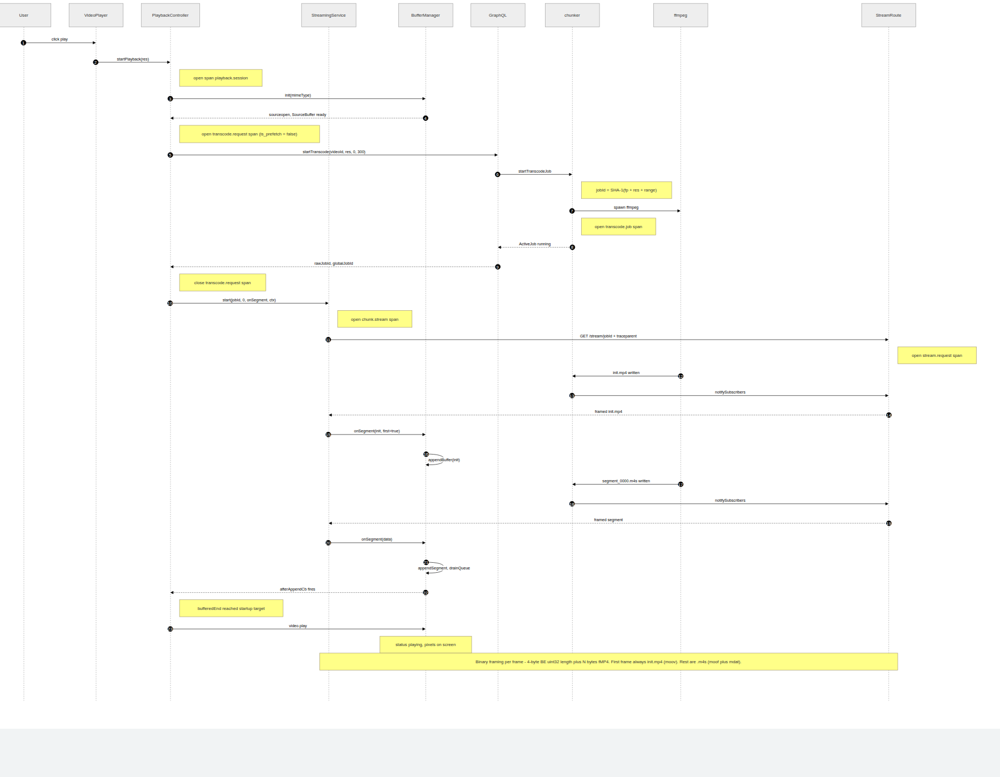
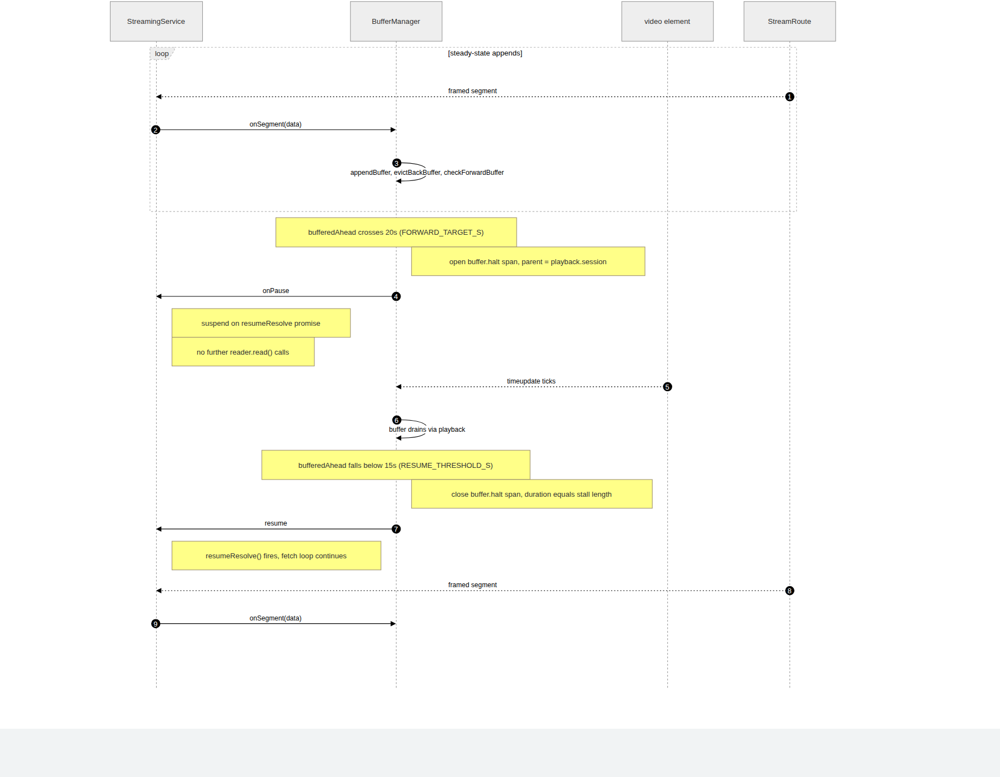
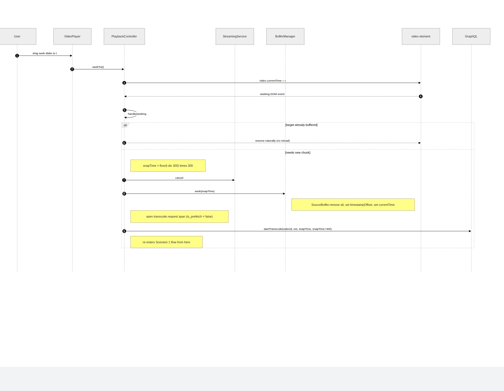
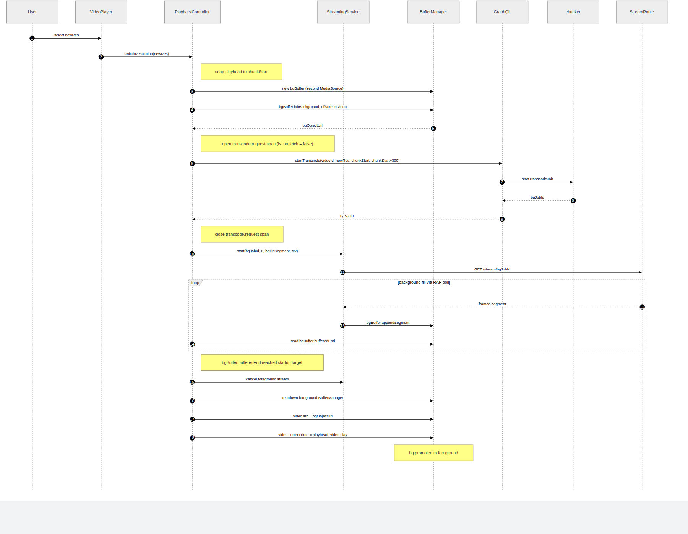

# Playback Scenarios

The client drives transcoding in **300-second chunks** rather than encoding the full video upfront. Each chunk is a separate ffmpeg job covering a time window `[startS, endS)`. Four distinct flows cover the pipeline end-to-end: initial playback, back-pressure, seek, and resolution switch. Each has its own sequence diagram below; the `.mmd` sources are authoritative and can be re-rendered in draw.io via the `open_drawio_mermaid` MCP tool.

## Scenario 1: Initial playback (happy path)

> Source: [`streaming-01-initial-playback.mmd`](../../diagrams/streaming-01-initial-playback.mmd)

`PlaybackController.startPlayback(res)` opens the `playback.session` span and drives the boot sequence:

1. `BufferManager.init(mimeType)` creates a `MediaSource` and arms a `SourceBuffer`.
2. `PlaybackController.requestChunk` opens a `transcode.request` span (with `chunk.is_prefetch = false`) around the `startTranscode` GraphQL mutation for the `(videoId, resolution, 0, 300)` window. The auto-generated `graphql.request` HTTP span nests underneath via `context.with`. The span closes when the mutation resolves and records `chunk.job_id`.
3. `chunker.startTranscodeJob` computes a deterministic `jobId = SHA-1(fingerprint + res + start + end)`. If `tmp/segments/<jobId>/init.mp4` exists the job is restored from cache; otherwise a new ffmpeg process spawns and `fs.watch` starts tracking segment files. The `transcode.job` span covers the full ffmpeg lifetime (probe + encode) and closes on `transcode_complete`, `transcode_error`, or `transcode_killed`.
4. The client opens a `chunk.stream` span and calls `StreamingService.start(jobId, …, ctx)`. `ctx` is propagated as `traceparent`, so the server's `stream.request` span nests under the client's `chunk.stream`. On span end it records `chunk.bytes_streamed` and `chunk.segments_received` — giving per-chunk bandwidth in a single Seq query.
5. `GET /stream/<jobId>` waits up to 60 s for `init.mp4`, writes it length-prefixed, then loops over newly-appearing `segment_NNNN.m4s` files.
6. `StreamingService` accumulates bytes, extracts complete frames by the 4-byte length prefix, and calls `onSegment(data, isInit)` back into `BufferManager`.
7. `BufferManager.appendSegment` serialises `SourceBuffer.appendBuffer` calls through a queue. After each append it runs `evictBackBuffer()`, `checkForwardBuffer()`, and the `afterAppendCb`.
8. Once `bufferedEnd >= STARTUP_BUFFER_S[res]`, `video.play()` is called and `status` flips to `playing`.

### Chunk chaining

When the current chunk stream finishes, `startChunkSeries` chains to the next one. A RAF prefetch loop fires the next chunk's `startTranscode` mutation when `currentTime > chunkEnd - 60s`, so the next `jobId` is usually already in hand (`nextJobIdRef`) — no mutation RTT before streaming resumes. Prefetch requests open their own `transcode.request` span with `chunk.is_prefetch = true`, so Seq queries can separate prefetch RTT from on-demand RTT. Continuation chunks skip re-appending the init segment; the `SourceBuffer` (in `mode="sequence"`) picks up seamlessly.

### Connection-aware ffmpeg lifecycle

`ActiveJob.connections` tracks open `/stream/:jobId` HTTP connections:

- `addConnection(id)` increments on stream open.
- `removeConnection(id)` decrements on disconnect, stream completion, or the 90 s idle timeout.
- When `connections` drops to `0` while the job is still `running`, `killJob(id)` sends `SIGTERM` to ffmpeg.

ffmpeg dies within seconds of the last tab closing — no zombies. `chunker.startTranscodeJob` also enforces `MAX_CONCURRENT_JOBS = 3`; a fourth simultaneous transcode throws `"Too many concurrent streams"`, surfaced as a playback error.

## Scenario 2: Back-pressure (pause and resume)

> Source: [`streaming-02-backpressure.mmd`](../../diagrams/streaming-02-backpressure.mmd)

Once the steady-state append loop is running, `BufferManager.checkForwardBuffer` runs after every append. If `bufferedAhead > FORWARD_TARGET_S (60 s)` it opens a `buffer.halt` span (parented on `playback.session` so it survives chunk boundaries) and calls `StreamingService.pause()`, which suspends the fetch loop on a `resumeResolve` promise — no further `reader.read()` calls are issued, so TCP back-pressure propagates all the way to the server's write loop and ffmpeg throttles naturally.

As the `<video>` element plays and `timeupdate` fires, `bufferedAhead` drains. When it falls below `FORWARD_RESUME_S (20 s)`, the `BufferManager` calls `StreamingService.resume()`, which resolves the promise and reawakens `reader.read()`, and closes the `buffer.halt` span with `buffer.buffered_ahead_s_at_resume` recorded. The 60 s / 20 s split is a 40-second hysteresis gap — wide enough that each pause/drain cycle lasts ~40 s and cycles don't chain back-to-back at steady state, so one halt = one span and the span duration reads directly as the stall length. Seeks and teardowns close the span early via a `halt_ended_by_seek` or `halt_ended_by_teardown` event. See [`../Streaming/00-Protocol.md#hysteresis-tuning-the-gap`](./00-Protocol.md#hysteresis-tuning-the-gap) for the considerations behind those numbers.

## Scenario 3: Seek

> Source: [`streaming-03-seek.mmd`](../../diagrams/streaming-03-seek.mmd)

When the user drags the slider, `VideoPlayer` forwards a `SeekRequested` Nova event to `PlaybackController.seekTo(t)`, which sets `video.currentTime = t`. The DOM then fires the `seeking` event back into `PlaybackController.handleSeeking`.

If `t` lies within the current `SourceBuffer`'s buffered range, playback resumes naturally — no network activity. Otherwise:

1. `snapTime = Math.floor(t / 300) * 300` aligns the restart to a chunk boundary so the new job shares a cache directory with any existing `(videoId, res, snapTime)` job.
2. `StreamingService.cancel()` aborts the current fetch.
3. `BufferManager.seek(snapTime)` flushes the `SourceBuffer` (`remove(0, Infinity)`), resets `timestampOffset`, and sets `video.currentTime`.
4. `startTranscode(videoId, res, snapTime, snapTime + 300)` re-enters the Scenario 1 flow from the GraphQL step onward.

## Scenario 4: Resolution switch (background buffer)

> Source: [`streaming-04-resolution-switch.mmd`](../../diagrams/streaming-04-resolution-switch.mmd)

MSE's `SourceBuffer` can only be initialised with one MIME type / resolution profile for its lifetime. Switching resolution mid-playback therefore requires a fresh `MediaSource` — but tearing down the live one would blank the screen. Instead a second `BufferManager` is created offscreen:

1. `PlaybackController.switchResolution(newRes)` snaps the current playhead to the nearest chunk boundary (`chunkStart`).
2. `bgBuffer.initBackground()` creates a `MediaSource` attached to an offscreen `<video>`, returning a `bgObjectUrl`. `sourceopen` fires and the background `SourceBuffer` is armed without disturbing the visible `<video>`.
3. A new transcode job starts at `(videoId, newRes, chunkStart, chunkStart + 300)` and streams silently into `bgBuffer`.
4. A RAF loop polls `bgBuffer.bufferedEnd`. When it clears `STARTUP_BUFFER_S[newRes]`:
   - The foreground stream is cancelled and its `BufferManager` torn down (releasing the foreground object URL).
   - `video.src = bgObjectUrl`, `video.currentTime = playhead`, `video.play()`.
   - The background buffer is promoted to foreground.

The user sees a brief pause (< 1 s for lower resolutions) while `bgBuffer` fills — no flash of blank video.
